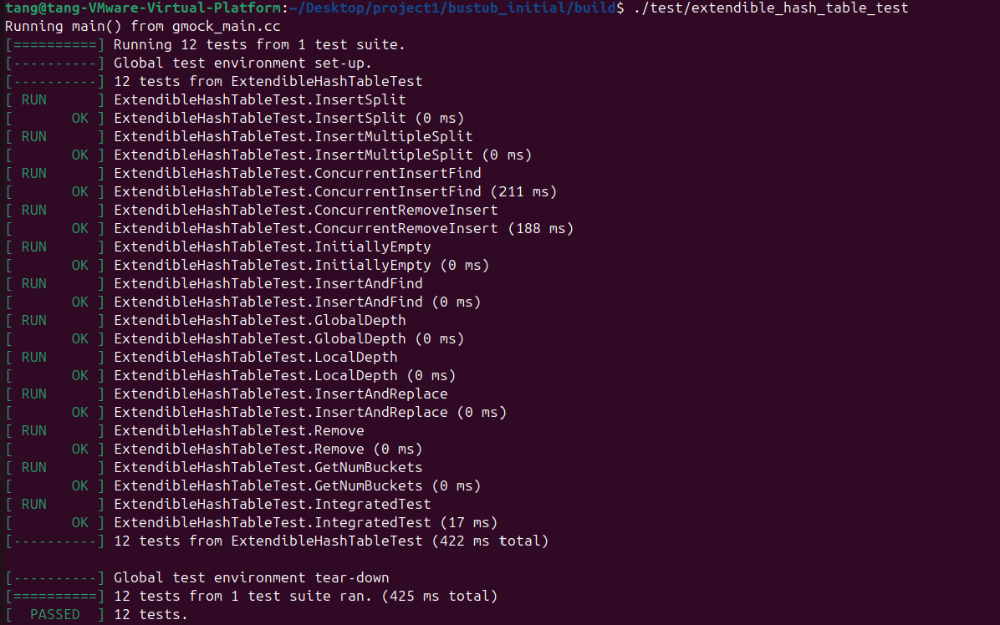
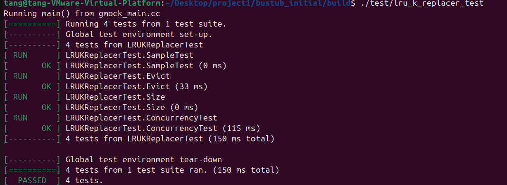

# 数据库小组作业

组长：唐彪

组员：顾佳颖、孙瑞雪、杨宝仪、张烘辉、曾宇阳

 

- [数据库作业](#数据库作业)
  - [第一次编程作业](#第一次编程作业)
    - [第一次编程代码](./project1/bustub_initial)
    - [extendible\_hash\_test](#extendible_hash_test)
    - [buffer\_pool\_manager\_test](#buffer_pool_manager_test)
    - [lru\_replacer\_test](#lru_replacer_test)

## 第一次编程作业

### extendible_hash_test

### lru_replacer_test

### buffer_pool_manager_test

