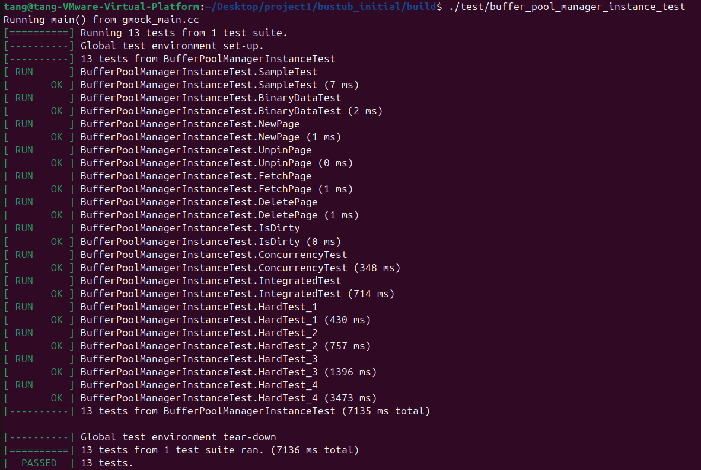
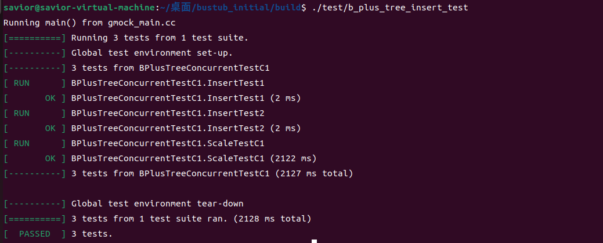
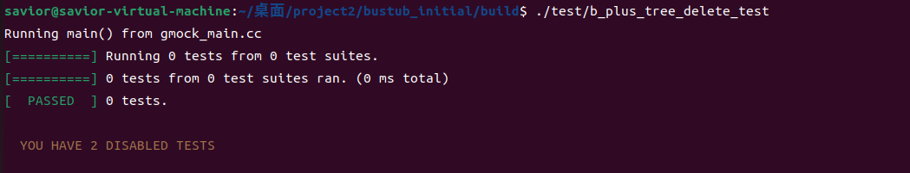

# 数据库小组作业

组长：唐彪

组员：顾佳颖、孙瑞雪、杨宝仪、张烘辉、曾宇阳

 

- [数据库作业](#数据库作业)
  - [第一次编程作业](#第一次编程作业)
    - [第一次编程代码](./project1/bustub_initial)
    - [第一次编程测试passed图片](./project1/result_images)
    - [extendible\_hash\_table\_test](#extendible_hash_table_test)
    - [lru\_k\_replacer\_test](#lru_k_replacer_test)
    - [buffer\_pool\_manager\_instance\_test](#buffer_pool_manager_instance_test)
  - [第二次编程作业](#第一次编程作业)
    - [第二次编程代码](./project2/bustub_initial)
    - [第二次编程测试passed图片](./project2/result_images)
    - [b\_plus\_tree\_insert\_test](#b_plus_tree_insert_test)
    - [b\_plus\_tree\_delete\_test](#b_plus_tree_delete_test)
    - [b\_plus\_tree\_concurrent\_test](#b_plus_tree_concurrent_test)

## 第一次编程作业

### extendible_hash_table_test

### lru_k_replacer_test

### buffer_pool_manager_instance_test

## 第二次编程作业

### b_plus_tree_insert_test

### b_plus_tree_delete_test

### b_plus_tree_concurrent_test

